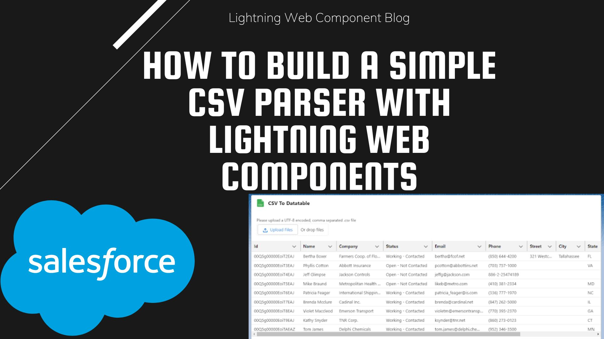

# CSV Parser with LWC

Preview any CSV file inside Salesforce with one Lightning Web Component and no server code.



> **Status: tutorial code from January 2023, not actively maintained.** It works as a teaching example of reading a
> file in an LWC. It only displays the CSV; it does not import or save records.

## What and why

Sometimes you just want to look at a CSV inside a Lightning page before deciding what to do with it. This component
reads the file in the browser, builds the table columns from the CSV header row, and shows the rows in a
`lightning-datatable`. No Apex, no static resources, no third-party CSV library.

It was written as the companion to my blog tutorial "How to Build a Simple CSV Parser with Lightning Web Components"
(January 2023).

## Features

- File picker limited to `.csv` files (`lightning-input type="file"`).
- Reads the file client-side with `FileReader`; nothing is sent to the server.
- Columns are generated from the header row, so any CSV shape works without configuration.
- Read-only `lightning-datatable` (500 px high, no checkbox column).
- Can be placed on App, Home and Record pages in Lightning App Builder.

## How it works

```text
lightning-input (file) ──onchange──▶ handleCSVUpload()   first selected file
                                     └─▶ read() ─▶ load()   FileReader.readAsText, wrapped in a Promise
                                                 └─▶ parseCSV()
                                                       • split lines on \r\n or \n
                                                       • line 1 → columns { label, fieldName }
                                                       • other lines → one object per row
                                                 └─▶ this.columns / this.data ─▶ lightning-datatable
```

Files:

| File | Purpose |
|---|---|
| `createCSVTotable/createCSVTotable.html` | Card, file input and datatable |
| `createCSVTotable/createCSVTotable.js` | File reading and CSV parsing |
| `createCSVTotable/createCSVTotable.js-meta.xml` | API version 55.0, exposed to App/Home/Record pages |

## Quick start

This repo holds the component folder only, not a full SFDX project.

1. Create or open an SFDX project and authorise an org (a Developer Edition or scratch org is fine):

   ```bash
   sf project generate --name csv-parser-demo
   cd csv-parser-demo
   sf org login web --alias csv-demo
   ```

2. Copy the component into the project:

   ```bash
   cp -R /path/to/CSV-Parser-with-LWC/createCSVTotable force-app/main/default/lwc/
   ```

3. Deploy it:

   ```bash
   sf project deploy start --source-dir force-app/main/default/lwc/createCSVTotable --target-org csv-demo
   ```

4. In the org, open Lightning App Builder, add **createCSVTotable** to an App, Home or Record page, and activate the
   page.

No Named Credentials, custom settings, Apex or permission sets are needed.

## Usage

1. Open the page with the component.
2. Click **Upload Files** (or drop a file) and choose a UTF-8, comma-separated `.csv` file.
3. The table shows one column per header and one row per line.

Use sample data when you try it; the file is only held in the browser tab.

## Limitations

- Fields are split on every comma, so quoted values that contain commas (for example `"Acme, Inc."`) break the
  columns. Use a real CSV parser (such as Papa Parse as a static resource) for production files.
- A trailing newline at the end of the file shows up as an empty row.
- The datatable's `key-field` is `Id`; files without an `Id` column have no unique row key.
- Read errors are caught but not shown to the user.
- Nothing is saved to Salesforce. To import, add an Apex method or the UI API to create records from `this.data`.

## Licence

No licence file yet, so all rights are reserved by the author until one is added.

## Author

Built by [Avnish Yadav](https://avnishyadav.com).
